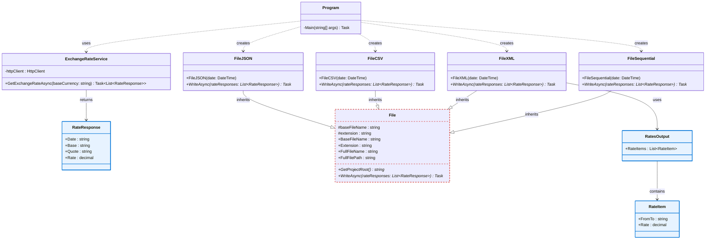

# ExchangeRate

## Project Overview

The ExchangeRate project is a C# application that fetches exchange rates from the Frankfurter API and exports them in multiple file formats (JSON, CSV, XML, and sequential/fixed-width format).

## Class Diagram

## Architecture

### Core Components

- **ExchangeRateService**: Handles API communication with Frankfurter API to fetch exchange rate data
  - Inner class `RateResponse` represents a single exchange rate with date, base currency, quote currency, and rate value

- **File (Abstract Base Class)**: Defines the contract for file writers
  - Manages file naming convention: `Cotations-YYYYMMDD.<extension>`
  - Provides abstract method `WriteAsync()` for subclasses to implement format-specific serialization

- **File Format Implementations**:
  - **FileJSON**: Exports rates as JSON objects
  - **FileCSV**: Exports rates as comma-separated values with header
  - **FileXML**: Exports rates as XML with nested structure
  - **FileSequential**: Exports rates as fixed-width format with padded integers and decimals

- **Program**: Entry point that orchestrates the workflow
  - Fetches exchange rates via `ExchangeRateService`
  - Creates writer instances for all supported formats
  - Executes async write operations
